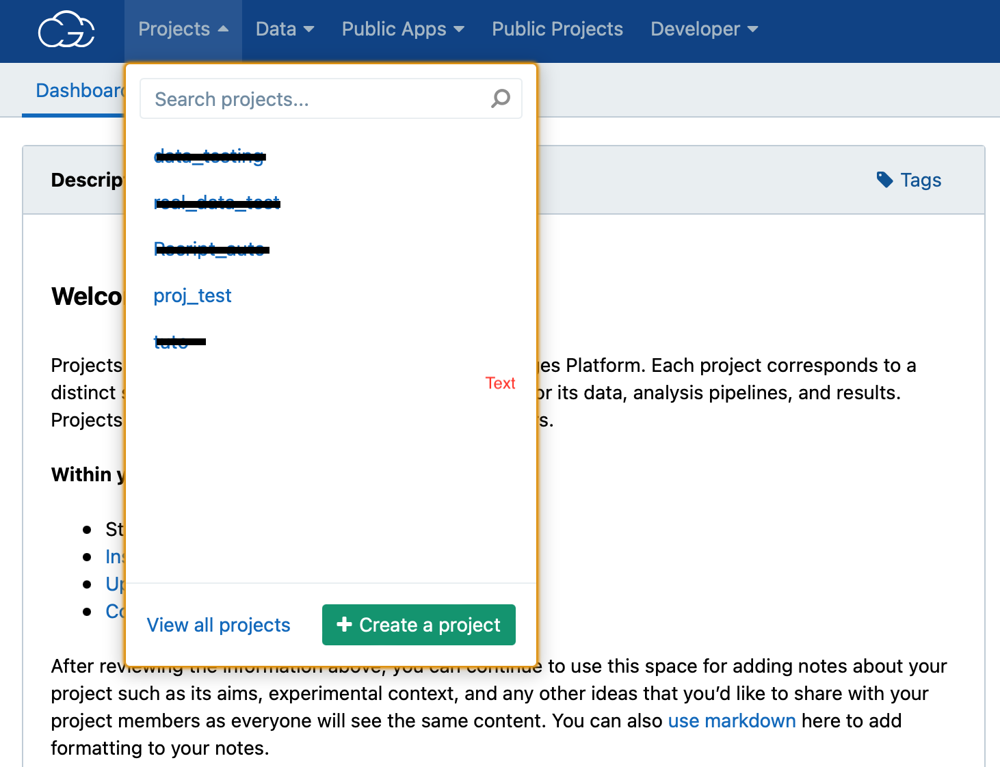
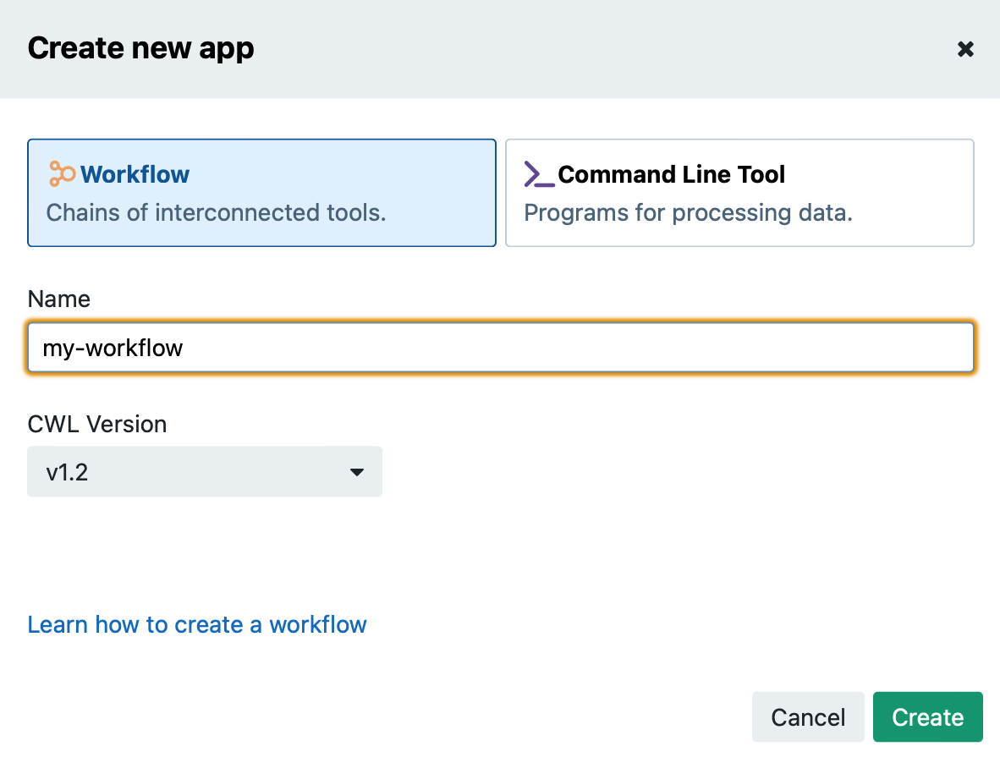
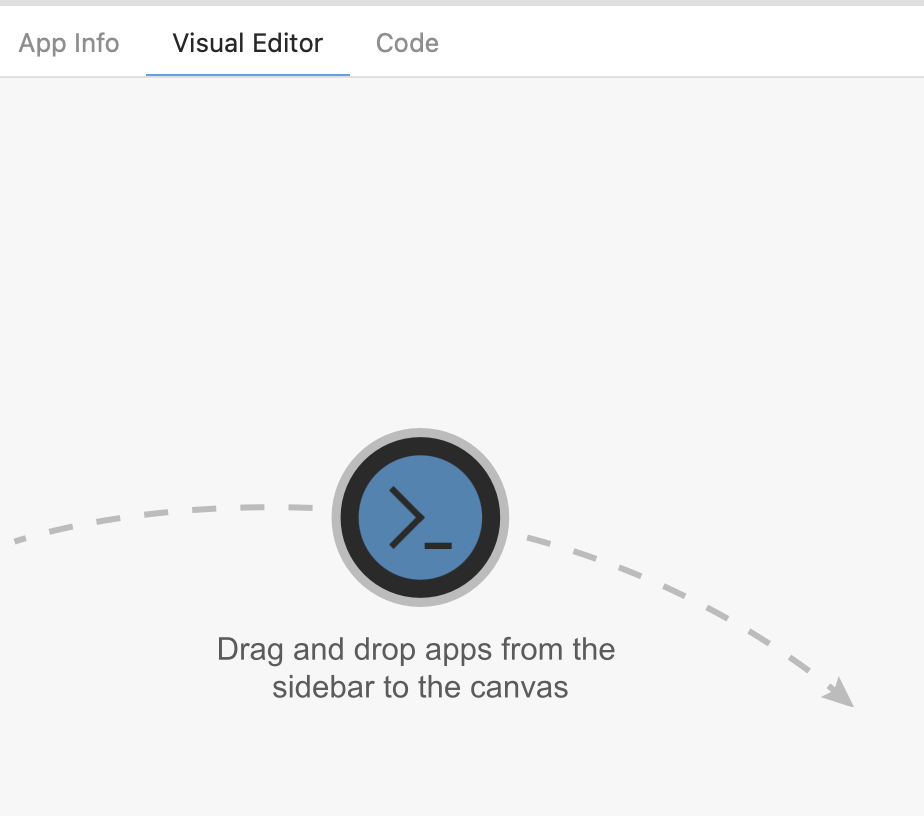
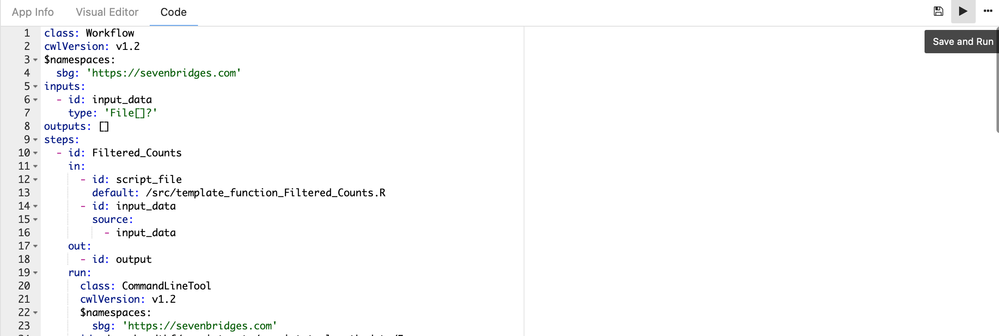
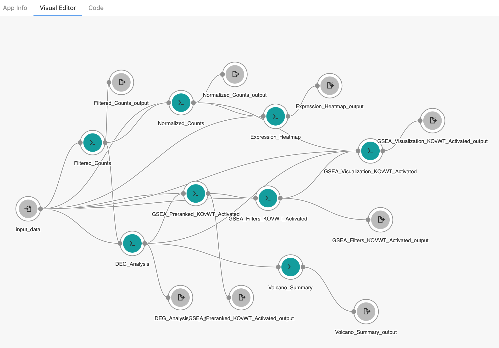
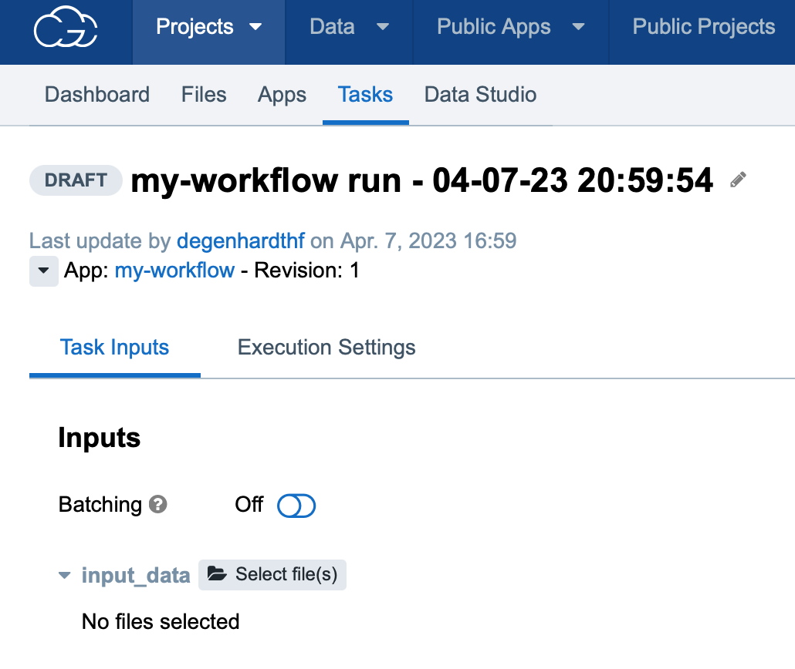

# SBG importer

## 1 - Requirements
The only software requirements are:
- [python 3.7](https://www.python.org/downloads/release/python-3716/)
- [docker](https://www.docker.com)
- An account on [SBG](http://cgc.sbgenomics.com) (There are pilot funds available for testing the platform)

If, by any reason, the docker image related to your project is already deployed in some registry you can just use the link to this docker image instead of building the image, without needing to install docker.

## 2 - Create your SBG token
The first step to be able to run the package is to create a creadentials file with your SBG token inside, so that the package can connect to the SBG server and deploy your docker image and project. For this purpose, the user needs to login into [SBG](http://cgc.sbgenomics.com), access the developer tools and select authentication token:


In the next windows one just needs press the buttom to create the token. For the next step, open the [credentials file](examples/credentials) example and modify it pasting your credential in the credentials field. Note: The field was already filled for you as an example, you should past your credential in the place of the example:


Then just create a directory for holding your credentials:

```bash
mkdir ~/.sevenbridges/
```

And copy you credentials file to this folder:

```bash
cp <path>/credentials ~/.sevenbridges/
```

And you are all set!

## 3 - Running the application
The mandatory step to run the application is having your project exported from NIDAP by using the [NIDAP Exporter](https://github.com/fnlcr-bids-sdsi/nidap-export/tree/main/nidap_exporter) package. Once you have the exported folder, just call:

```bash
python sbg_importer.py  <nidap-export-project> <project-name>
                        [<docker-registry-address>] [-f] [-h]
```

Where:
- nidap-export-project is a mandatory positional argument and is the path to the output of the [NIDAP Exporter](https://github.com/fnlcr-bids-sdsi/nidap-export/tree/main/nidap_exporter) applied to your project.
- project-name is a mandatory positional argument and is the name of the project that will be uploaded to SBG and also the output path where all the outputs generated by the script will be saved.
- project-name is an optional positional argument in case you already have your docker image available somewhere, so you can just add the URL here and this will be used as the docker image to run the pipeline. As default, the package will build the docker image for you and automatically deploy to SBG docker registry.
- [-f] allows you to force the operations, such as uploading a project that already exists (without forcing option you will have an error).
- [-h] will display the helper message to run the script.

Please, be aware that after creating the CWL files you will see a message like this on your terminal:

```bash
#################################################
#                     IMPORTANT                 #
# > Initial files required:                     #   
# var_dataset_x.rds                             #
# var_dataset_y.rds                             #
#################################################
```

That means that these 2 examples of .rds files will be necessary as the initial dataset for the workflow.

## 4 - Ultimate step
The ultimate step is to create the workflow on the project you just created and paste the cwl code generated by the package in the workflow source code. To do that, log into the [SBG](http://cgc.sbgenomics.com) website, access the Project tools and select the project you have just created:



Select the "App" task and click on the grey buttom on the top right corner called "Create app" (<b>not</b> the green):


A windows will appear asking for you to give a name to this workflow, just name it and press in the "Create" green button:



Which will lead you to the workflow editor:



Just press on the tab that says "code", which will open a file editor. Copy the content of the "workflow.cwl" file that was created under a folder called "cwl" inside your project folder into this editor:



To check how the topological graph looks like just select the "Visual Editor" tab on the top:



To run the application now you just need to press the "Save and Run" button (the triangle in the right top corner), and you will be redirected to the Task runner.



Where now you can choose the initial datasets that are needed to run your workflow. If you do not remember which they are, just check the step 3 of running this application, the name of the files should be prompted in your terminal. For selecting the input files just press in the "Select file(s)" button and select all the initial files (not the intermediate) that are needed for starting the pipeline. They should be inside the folder called "data" in the root directory of you project at SBG. With that done, we are good to run the task on SBG by pressing the "Run" blue button on the top right corner of the page!

After running the application, you will have access to all of the outputs generated in each step of the pipeline at the outputs session of the run. The files will also be available at the root directory of your project, so you can check them just selecting the "Files" tab.

